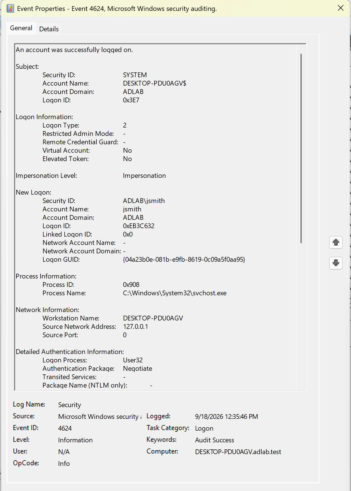
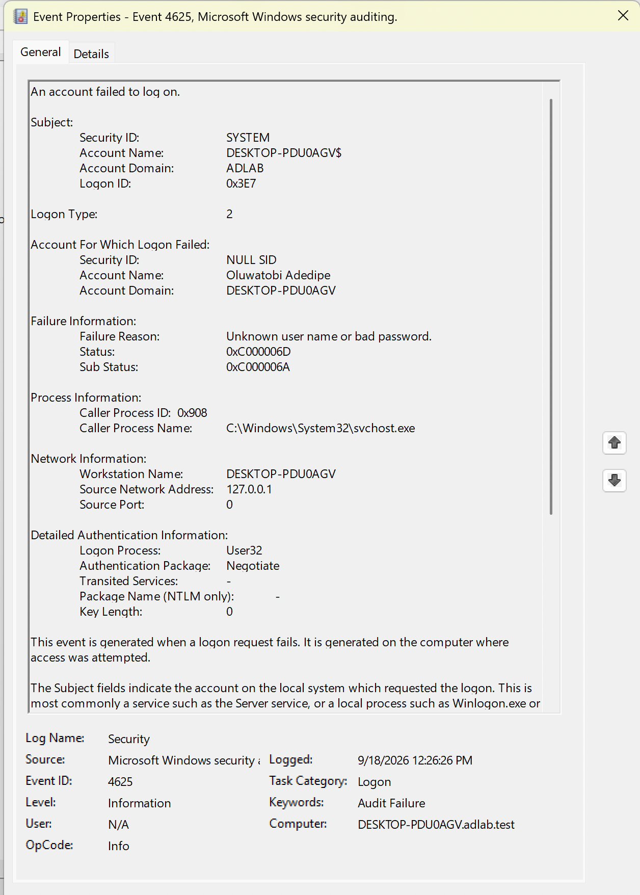

# Active Directory Attack & Defense Lab

A hands-on cybersecurity lab focused on building, securing, testing, and investigating an Active Directory environment.

## Project Status

🚧 In Progress

This repository is updated as each lab component is successfully implemented and verified.

## Current Progress

- ✅ Lab virtualization environment established
- ✅ Ubuntu Server ARM64 configured
- ✅ Samba Active Directory Domain Controller installed
- ✅ `adlab.test` domain provisioned
- ✅ Samba AD DC service verified
- ✅ Windows 11 workstation joined to the domain
- ✅ Active Directory users, groups, and organizational units created
- ✅ Windows security auditing configured and verified
- ✅ Normal domain activity testing
- ✅ Kali Linux ARM attack/testing machine configured and verified
- ✅ Active Directory enumeration
- ✅ Controlled AD security testing
- ✅ Detection and investigation
- ✅ Controlled account compromise
- ✅ Account lockout defensive hardening and retest
- ✅ Anonymous enumeration hardening and retest

## Lab Environment

The lab currently consists of:

- **macOS Host** — Physical host system
- **VMware Fusion** — Virtualization platform
- **Ubuntu Server ARM64** — Samba Active Directory Domain Controller
- **Windows 11 ARM** — Domain-joined Windows workstation
- **Kali Linux ARM** — Security testing system

## Active Directory Domain

- **Domain:** `adlab.test`
- **NetBIOS Domain:** `ADLAB`
- **Domain Controller:** `ad-dc01.adlab.test`

## Security Auditing

Windows Security auditing was configured and verified on the domain-joined Windows 11 workstation.

Verified security activity includes:

- **Event ID 4624** — Successful logon
- **Event ID 4625** — Failed logon
- **User Account Management** — Success and Failure auditing enabled

A successful domain logon using `ADLAB\jsmith` and a controlled failed authentication attempt were captured and reviewed in Windows Event Viewer.

## Controlled Security Testing

Controlled security testing was performed from the Kali Linux VM against the isolated Active Directory lab.

Verified testing included:

- Domain Controller service enumeration with Nmap
- Anonymous domain password-policy enumeration
- Anonymous domain-user enumeration
- Kerberos service-ticket acquisition for the configured `svc_sql` SPN
- Controlled failed SMB authentication

The Kerberos test successfully obtained a service ticket for the configured SPN. Kerberoast hash extraction and password cracking were not successfully completed and are therefore not claimed as project results.

All security testing was performed exclusively within the isolated lab environment.

## Controlled Compromise and Defensive Hardening

A deliberately weak lab account was used to perform a controlled credential attack from the Kali Linux VM. The recovered credentials were validated through authenticated SMB access to the Domain Controller.

Defensive controls were then implemented and retested:

- Configured an account lockout threshold of five failed attempts
- Verified account lockout with `NT_STATUS_ACCOUNT_LOCKED_OUT`
- Restricted anonymous Samba enumeration using `restrict anonymous = 2`
- Verified anonymous user enumeration no longer exposed domain accounts
- Verified anonymous password-policy enumeration no longer exposed policy information
- Verified anonymous RPC access was denied with `NT_STATUS_ACCESS_DENIED`

This demonstrated an end-to-end **attack → investigation → remediation → retesting** workflow within the isolated lab environment.

## Detection and Investigation

Failed SMB authentication activity generated from the Kali Linux VM was investigated using Samba authentication logs on the Domain Controller.

The investigation identified five failed authentication attempts from `192.168.106.129`, targeting the `jsmith` and `Administrator` accounts.

A Bash detection was created and validated to alert when five or more matching failed SMB authentication events are present in the monitored Samba log.

The detection was tested under both alerting and non-alerting conditions.

Detection rule:

`detection-rules/detect-smb-failures.sh`

## Controlled Account Compromise and Defense

A deliberately vulnerable domain account named `weakuser` was configured with a weak password for controlled security testing.

A password attack from the Kali Linux VM successfully identified the account password. The recovered credentials were then used to authenticate to the Domain Controller over SMB and access the `SYSVOL` share.

Samba authentication logs were investigated and showed repeated failed password attempts from the Kali Linux system followed by successful authentication.

The domain was then hardened by changing the account lockout threshold from unlimited attempts (`0`) to five failed attempts.

A defensive retest verified that five incorrect authentication attempts locked the account. A subsequent authentication attempt using the correct password returned:

`NT_STATUS_ACCOUNT_LOCKED_OUT`

This demonstrated a complete attack-and-defense cycle:

**Weak credential → password attack → credential discovery → authenticated SMB access → investigation → hardening → defensive retest**

The compromise was limited to the deliberately vulnerable standard domain account. No privilege escalation or Domain Administrator compromise is claimed.

## Documentation

- [Lab Environment](docs/01-lab-environment.md)
- [Active Directory Domain Controller Setup](docs/02-active-directory-domain-controller-setup.md)
- [Windows 11 Domain Join](docs/03-domain-join.md)
- [Active Directory Objects](docs/04-active-directory-objects.md)
- [Security Auditing](docs/05-security-auditing.md)
- [Normal Domain Activity Baseline](docs/06-normal-domain-activity.md)
- [Kali Linux Attack Machine](docs/07-kali-attack-machine.md)
- [Active Directory Enumeration](docs/08-ad-enumeration.md)
- [Controlled AD Security Testing](docs/09-controlled-ad-security-testing.md)
- [Detection and Investigation](docs/10-detection-and-investigation.md)
- [Controlled Account Compromise and Defense](docs/11-controlled-account-compromise-and-defense.md)
- [Defensive Hardening](docs/12-defensive-hardening.md)

## Evidence

### Samba Active Directory Domain

### Successful Domain Logon

### Failed Authentication

