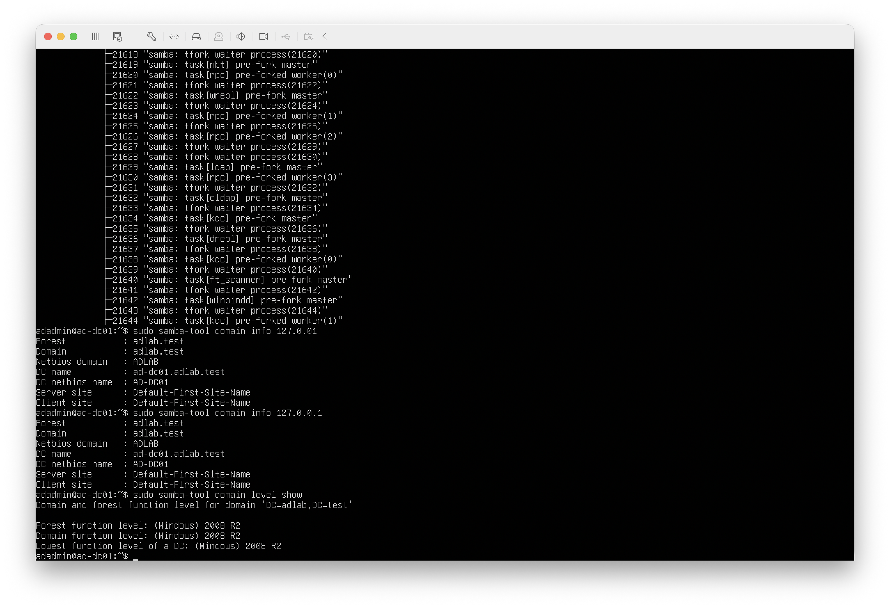

# Active Directory Attack & Defense Lab

A hands-on cybersecurity lab focused on building, securing, testing, and investigating a Microsoft Active Directory environment.

## Project Status

🚧 In Progress

This repository will be updated as each lab component is successfully implemented and tested.
## Current Progress

- ✅ Lab virtualization environment established
- ✅ Ubuntu Server ARM64 configured
- ✅ Samba Active Directory Domain Controller installed
- ✅ `adlab.test` domain provisioned
- ✅ Samba AD DC service verified as active
- ✅ Windows 11 workstation domain join
- ✅ Active Directory users, groups, and organizational units
- ⏳ Security auditing
- ⏳ Attack simulations
- ⏳ Detection and investigation
- ⏳ Defensive hardening

## Lab Environment

The lab currently consists of:

- **macOS Host** — Physical host system
- **VMware Fusion** — Virtualization platform
- **Ubuntu Server ARM64** — Samba Active Directory Domain Controller
- **Windows 11 ARM** — Windows workstation
- **Kali Linux ARM** — Security testing system

## Active Directory Domain

- **Domain:** `adlab.test`
- **NetBIOS Domain:** `ADLAB`
- **Domain Controller:** `ad-dc01.adlab.test`

## Documentation

- [Lab Environment](docs/01-lab-environment.md)
- [Active Directory Domain Controller Setup](docs/02-active-directory-domain-controller-setup.md)
- [Windows 11 Domain Join](docs/03-domain-join.md)
- [Active Directory Objects](docs/04-active-directory-objects.md)

## Evidence

