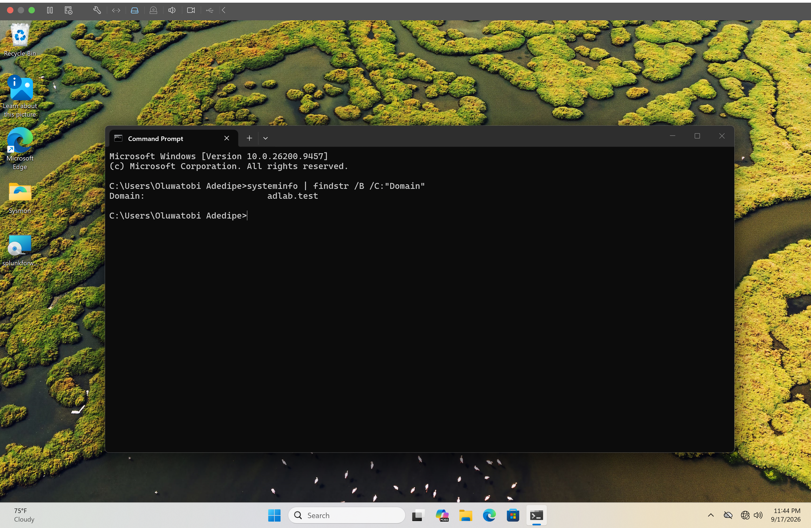

# Windows 11 Domain Join

## Overview

A Windows 11 workstation was joined to the `adlab.test` Active Directory domain hosted by the Samba Active Directory Domain Controller.

## Domain Controller

- Hostname: `AD-DC01`
- Domain: `adlab.test`
- Domain Controller IP: `192.168.106.131`
- Platform: Ubuntu Server ARM64
- Active Directory implementation: Samba AD DC

## Windows 11 Workstation Configuration

The Windows 11 workstation was configured to use the domain controller as its DNS server:

`192.168.106.131`

DNS resolution and network connectivity to the domain controller were verified before attempting the domain join.

The workstation was then joined to:

`adlab.test`

using an authorized domain administrator account.

## Verification

After restarting the workstation, domain membership was verified with:

```cmd
systeminfo | findstr /B /C:"Domain"
```

The command returned:

```text
Domain: adlab.test
```

This confirmed that the Windows 11 workstation successfully joined the Active Directory domain.

## Evidence


