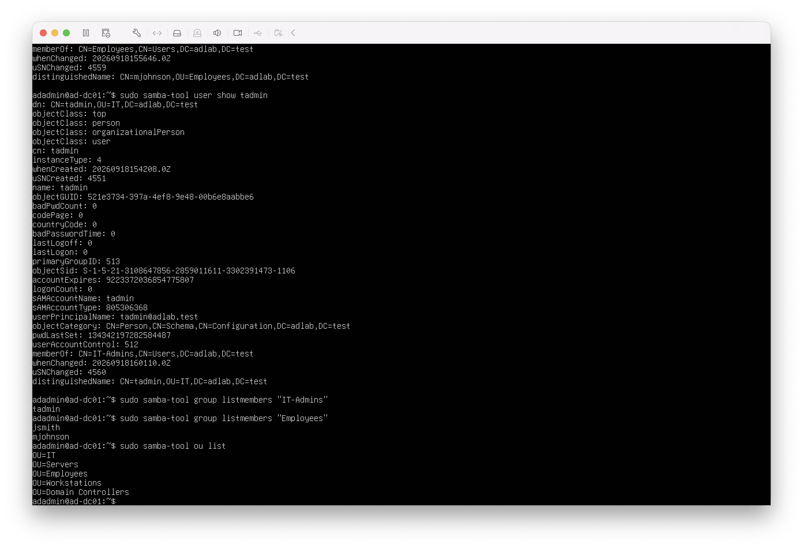

# Active Directory Objects

## Overview

After configuring the Samba Active Directory domain controller, organizational units, domain users, and security groups were created to provide a structured lab environment for later security testing and defensive monitoring.

## Organizational Units

The following OUs were created:

- Employees
- IT
- Servers
- Workstations

The default Domain Controllers OU is also present.

## Domain Users

Three lab user accounts were created:

- `jsmith`
- `mjohnson`
- `tadmin`

The accounts were created using `samba-tool`.

## Security Groups

Two groups were configured:

### Employees

Members:

- `jsmith`
- `mjohnson`

### IT-Admins

Members:

- `tadmin`

## Organizational Structure

The user accounts were moved into their appropriate organizational units:

- `jsmith` → Employees
- `mjohnson` → Employees
- `tadmin` → IT

## Verification

The configuration was verified using Samba administration commands including:

```bash
sudo samba-tool ou list
sudo samba-tool user show jsmith
sudo samba-tool user show mjohnson
sudo samba-tool user show tadmin
sudo samba-tool group listmembers "Employees"
sudo samba-tool group listmembers "IT-Admins"
```

The verification confirmed that the organizational units, user locations, and group memberships were configured successfully.

## Evidence


