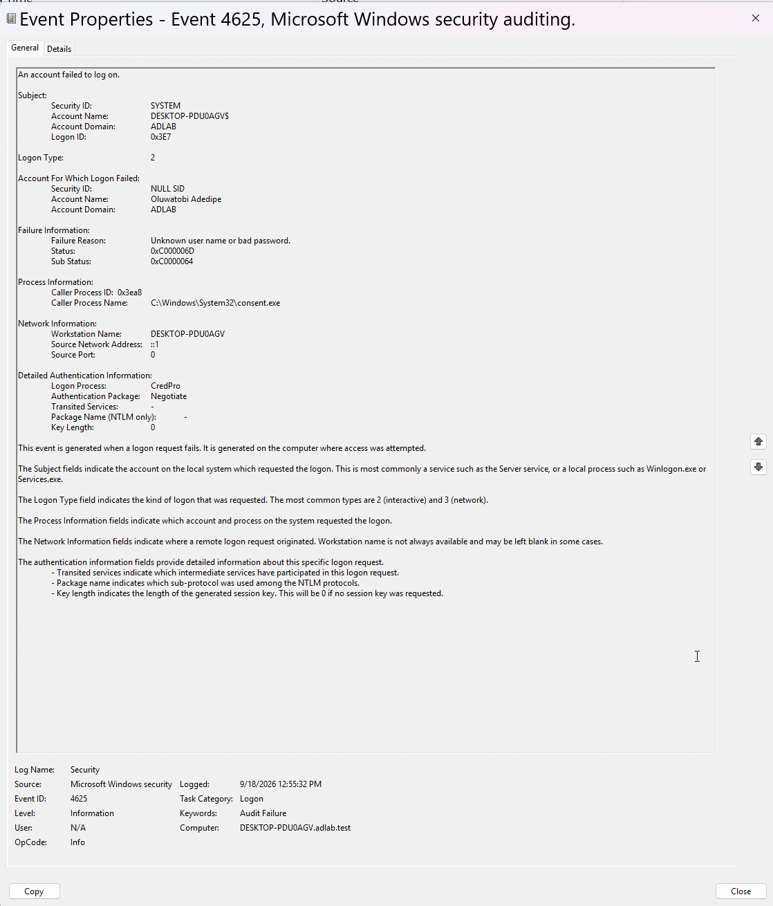

# Security Auditing

Windows Security auditing was configured and verified on the domain-joined Windows 11 workstation.

## Successful Logon Auditing

Successful authentication activity was verified using Windows Security **Event ID 4624 — An account was successfully logged on**.

A successful domain logon for `ADLAB\jsmith` was observed in Event Viewer, confirming that domain authentication activity is being recorded on the workstation.

## Failed Logon Auditing

Failed authentication activity was verified using Windows Security **Event ID 4625 — An account failed to log on**.

A controlled incorrect-password attempt was performed in the lab and the resulting Event ID 4625 was reviewed in Event Viewer. The event contained information including the account involved, failure reason, logon type, process information, and source network address.

## User Account Management Auditing

The User Account Management audit policy was checked using:

```cmd
auditpol /get /subcategory:"User Account Management"
```

The policy initially showed successful auditing enabled.

Success and failure auditing were then enabled using:

```cmd
auditpol /set /subcategory:"User Account Management" /success:enable /failure:enable
```

Verification confirmed:

```text
User Account Management    Success and Failure
```

## Verification

The testing confirmed that the Windows 11 domain-joined workstation records security events that can be used to investigate successful authentication, failed authentication attempts, and account-management activity.

These audit logs will provide evidence for later controlled security testing and investigation phases of the lab.

