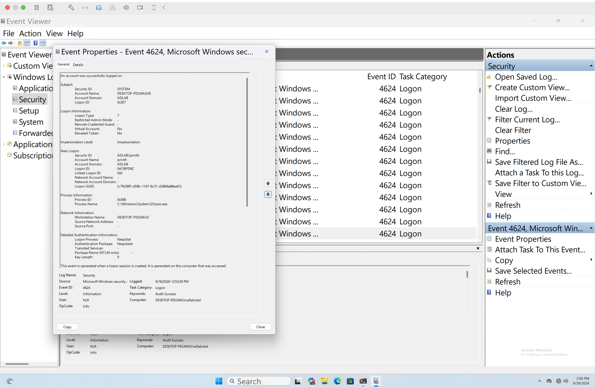

# Normal Domain Activity Baseline

## Objective

Establish and verify normal Active Directory activity before performing controlled security testing.

## Domain Connectivity Verification

The Windows 11 workstation successfully communicated with the Samba Active Directory Domain Controller `ad-dc01.adlab.test`.

Domain connectivity and Group Policy functionality were verified using:

- `nltest /dsgetdc:adlab.test`
- `gpresult /r`
- `gpupdate /force`
- SYSVOL policy access

Both computer and user Group Policy updates completed successfully.

## Successful Domain Authentication

Normal authentication activity was generated using the domain account:

`ADLAB\jsmith`

Windows Event Viewer recorded successful authentication activity as:

- Event ID: `4624`
- Event Type: Successful Logon
- Account: `jsmith`
- Domain: `ADLAB`

This establishes a normal authentication baseline that can later be compared with controlled attack simulations and suspicious authentication activity.

## Evidence

