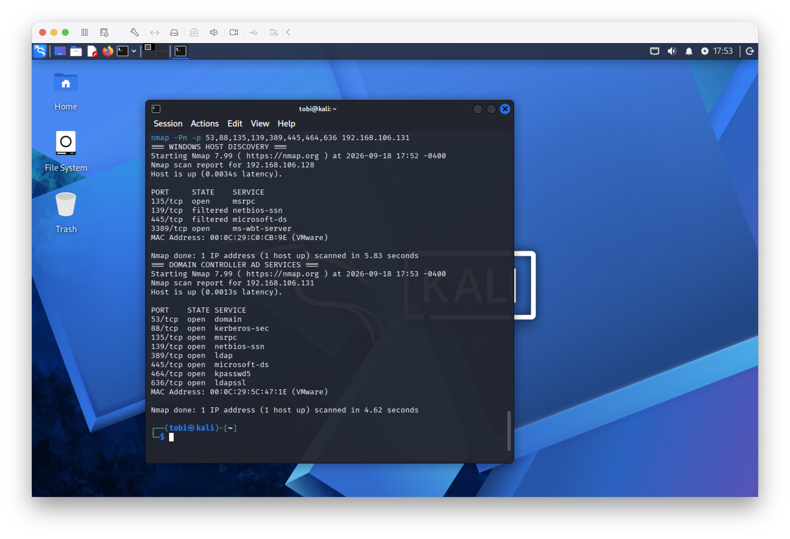

# Kali Linux Security Testing Machine

A Kali Linux ARM virtual machine was configured as the authorized security-testing system for the Active Directory lab.

## Environment

- Kali Linux ARM64
- VMware Fusion
- Active Directory domain: `adlab.test`
- Domain Controller: `ad-dc01.adlab.test`
- Domain Controller IP: `192.168.106.131`

## DNS Configuration

Kali was configured to use the Samba Active Directory Domain Controller (`192.168.106.131`) as its DNS server.

DNS verification successfully resolved:

- `ad-dc01.adlab.test`
- Kerberos SRV records
- LDAP SRV records

## Installed Security Tools

The following tools were verified on the Kali system:

- Nmap
- smbclient
- ldapsearch

## Network Verification

Nmap was used to verify connectivity between the Kali testing machine and the lab systems.

The Domain Controller exposed expected Active Directory services including:

- DNS — TCP 53
- Kerberos — TCP 88
- LDAP — TCP 389
- SMB — TCP 445
- Kerberos password service — TCP 464
- LDAPS — TCP 636

The Windows workstation was also reachable through exposed TCP services.

## Evidence

All testing was performed within the authorized isolated lab environment.
