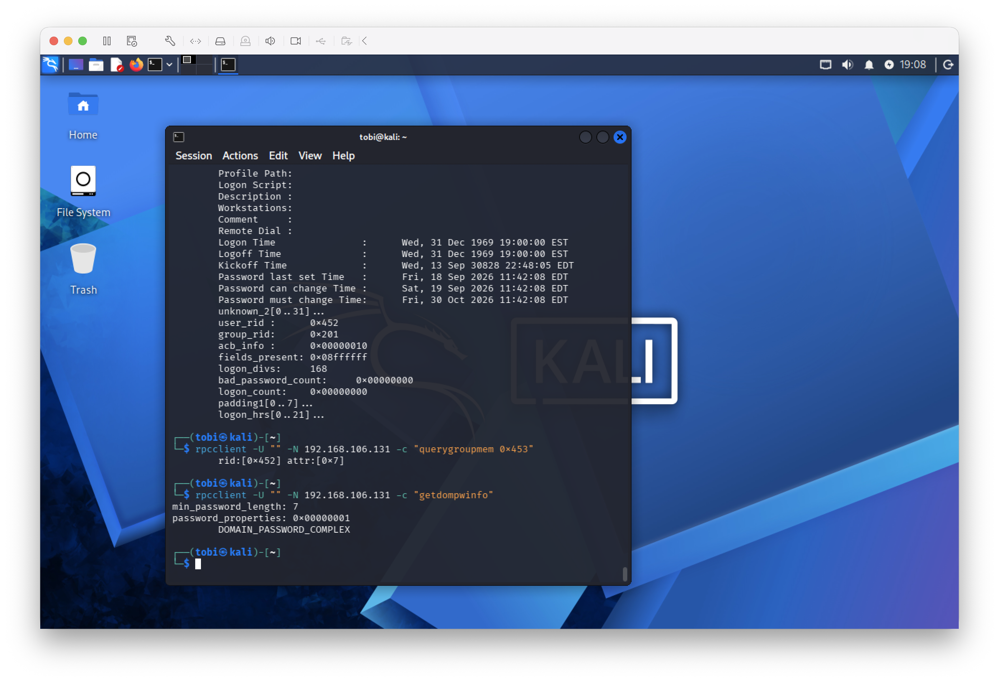

# Active Directory Enumeration

## Objective

Perform controlled enumeration against the Active Directory domain controller from the Kali Linux VM to identify information exposed to an unauthenticated network user.

All testing was performed inside the authorized isolated lab environment.

## Target

- Domain: `ADLAB.TEST`
- Domain Controller: `192.168.106.131`
- Testing System: Kali Linux

## RPC Enumeration

Anonymous RPC enumeration was tested using `rpcclient`.

The testing successfully identified domain information including:

- Domain users
- Domain groups
- Individual user account information
- Domain password policy information

The domain password policy enumeration returned:

- Minimum password length: 7 characters
- Password complexity: Enabled

## Security Observation

Anonymous RPC queries exposed information about the Active Directory environment without authenticated domain credentials. This information could assist an attacker during reconnaissance and account enumeration.

This configuration will be reviewed during the defensive-hardening phase of the lab.

## Evidence

