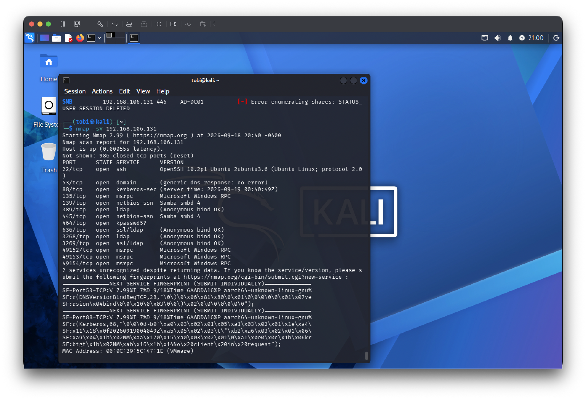
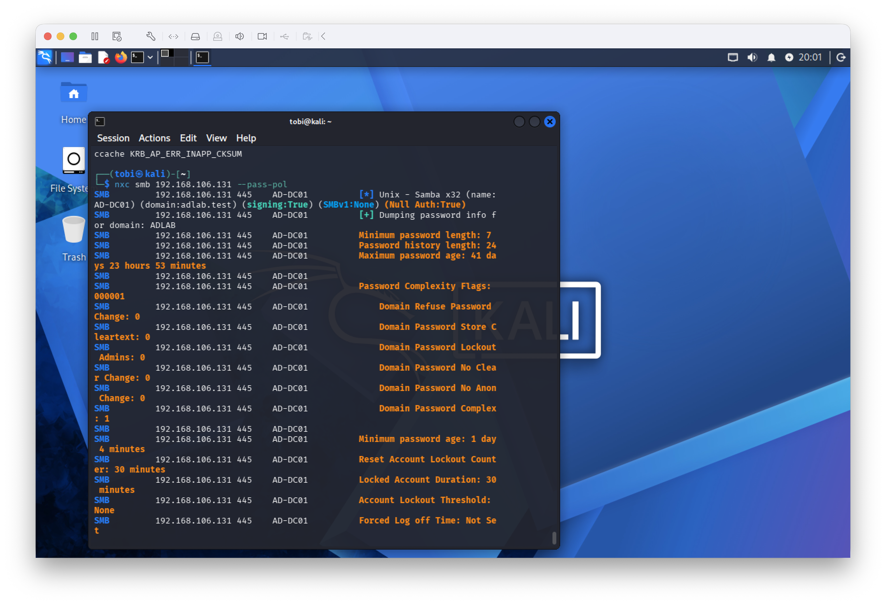
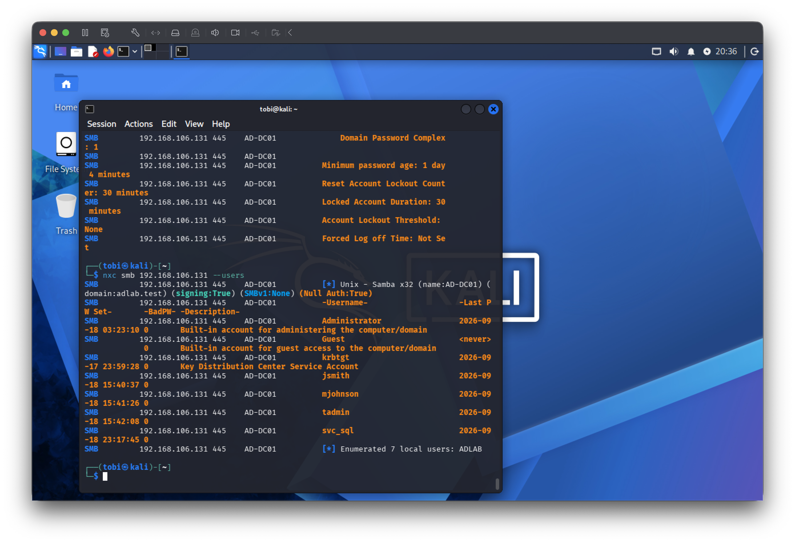
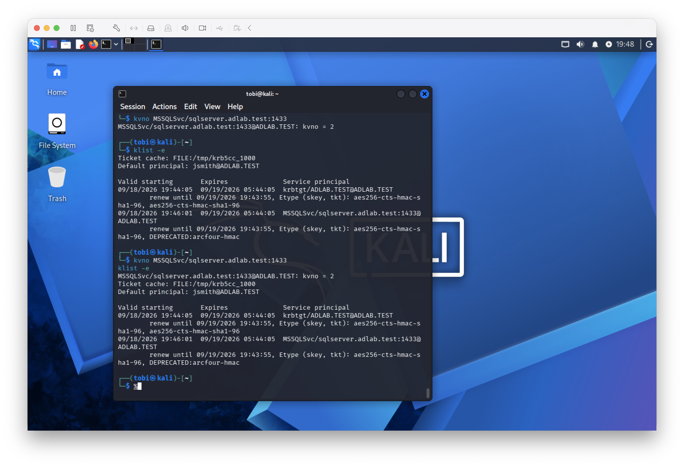

# Controlled Active Directory Security Testing

## Objective

The objective of this phase was to perform controlled security testing against the Active Directory environment from the Kali Linux VM.

All testing was performed against systems in the isolated lab environment.

## Test Environment

- Domain: `adlab.test`
- Domain Controller: `AD-DC01`
- Domain Controller IP: `192.168.106.131`
- Testing System: Kali Linux
- Kali IP: `192.168.106.129`

---

## 1. Domain Controller Service Enumeration

Nmap service detection was performed against the domain controller to identify network services exposed by the Samba Active Directory environment.

```bash
nmap -sV 192.168.106.131
```

The scan identified services associated with the domain environment, including DNS, Kerberos, LDAP/LDAPS, SMB, RPC, and SSH.



---

## 2. Anonymous Password Policy Enumeration

NetExec was used to test whether domain password-policy information could be retrieved without supplying credentials.

```bash
nxc smb 192.168.106.131 --pass-pol
```

The test successfully exposed domain password-policy information, including:

- Minimum password length: 7 characters
- Password history length: 24
- Password complexity enabled
- Account lockout threshold: None



This finding was preserved for later defensive review and hardening.

---

## 3. Anonymous Domain User Enumeration

NetExec was used to determine whether domain account information could be enumerated without supplying credentials.

```bash
nxc smb 192.168.106.131 --users
```

The test successfully enumerated domain accounts, including the lab-created users and service account.



This demonstrated that account information was accessible through the tested unauthenticated SMB enumeration path.

---

## 4. Kerberos Service Ticket Test

A service account named `svc_sql` was configured with the following Service Principal Name (SPN):

```text
MSSQLSvc/sqlserver.adlab.test:1433
```

The Kali system successfully obtained a Kerberos service ticket for the SPN using the authenticated `jsmith` domain account.

```bash
kvno MSSQLSvc/sqlserver.adlab.test:1433
klist -e
```

The resulting Kerberos cache contained a ticket for:

```text
MSSQLSvc/sqlserver.adlab.test:1433@ADLAB.TEST
```



### Testing Limitation

Attempts to request/export the ticket through the installed Impacket tooling produced a `KRB_AP_ERR_INAPP_CKSUM` error.

Because a Kerberoast-compatible hash was not successfully extracted or cracked, this project does **not** claim successful Kerberoasting or password recovery.

The verified result is limited to successful Kerberos service-ticket acquisition for the configured SPN.

---

## 5. Controlled Failed Authentication Test

A deliberately incorrect password was submitted for the `jsmith` domain account from the Kali Linux VM using SMB.

The client returned:

```text
NT_STATUS_LOGON_FAILURE
```

The purpose of this test was to generate controlled failed-authentication activity that could later be investigated from the domain controller.

The corresponding server-side investigation is documented separately during the investigation phase.

---

## Phase 8 Result

Controlled security testing successfully demonstrated:

- Domain controller network-service discovery
- Anonymous domain password-policy enumeration
- Anonymous domain-user enumeration
- Kerberos service-ticket acquisition for a configured SPN
- Controlled failed SMB authentication

Unsuccessful or unsupported techniques were not represented as successful attacks.

All security testing was performed exclusively within the isolated Active Directory lab environment.
