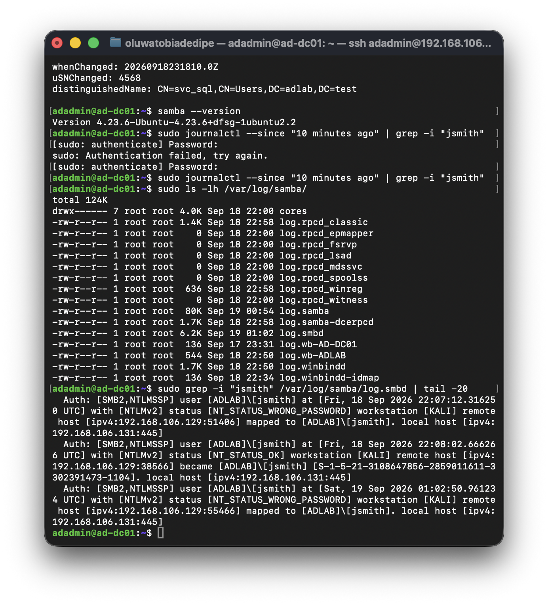
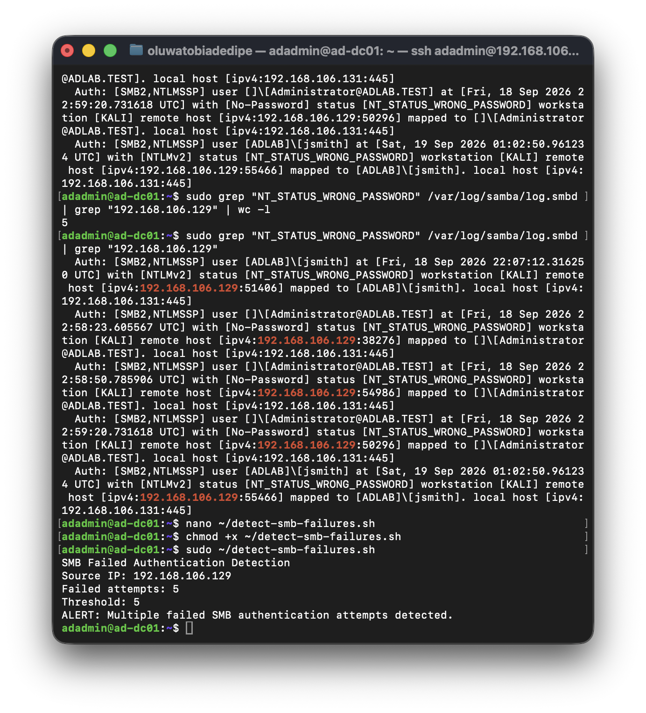

# SMB Failed Authentication Detection and Investigation

## Objective

The objective of this phase was to investigate failed SMB authentication activity recorded by the Samba Active Directory Domain Controller and build a simple detection for repeated authentication failures.

All activity was generated and analyzed within the isolated lab environment.

## Investigation

A controlled failed SMB authentication attempt was generated from the Kali Linux VM against the domain controller.

The Samba authentication log was reviewed using:

```bash
sudo grep -i "jsmith" /var/log/samba/log.smbd | tail -20
```

The log identified the failed authentication with:

- **Domain:** `ADLAB`
- **Account:** `jsmith`
- **Workstation:** `KALI`
- **Source IP:** `192.168.106.129`
- **Destination:** `192.168.106.131:445`
- **Protocol:** SMB2 / NTLMSSP
- **Result:** `NT_STATUS_WRONG_PASSWORD`



## Authentication Failure Analysis

The Samba logs were filtered for failed password attempts originating from the Kali Linux VM.

```bash
sudo grep "NT_STATUS_WRONG_PASSWORD" /var/log/samba/log.smbd | grep "192.168.106.129"
```

Five matching failed authentication events were identified.

Further review confirmed:

- `jsmith` — 2 failed attempts
- `Administrator` — 3 failed attempts
- Total — 5 failed attempts

## Detection Logic

A Bash detection script was created to count `NT_STATUS_WRONG_PASSWORD` events originating from the Kali Linux VM.

The detection uses a threshold of five matching events.

```bash
#!/bin/bash

LOG="/var/log/samba/log.smbd"
THRESHOLD=5

COUNT=$(grep "NT_STATUS_WRONG_PASSWORD" "$LOG" | grep "192.168.106.129" | wc -l)

echo "SMB Failed Authentication Detection"
echo "Source IP: 192.168.106.129"
echo "Failed attempts: $COUNT"
echo "Threshold: $THRESHOLD"

if [ "$COUNT" -ge "$THRESHOLD" ]; then
    echo "ALERT: Multiple failed SMB authentication attempts detected."
else
    echo "No alert threshold reached."
fi
```

The detection rule is preserved in:

`detection-rules/detect-smb-failures.sh`

## Detection Validation

The detection was tested against the recorded lab activity.

With five failed attempts and a threshold of five, the script generated:

```text
ALERT: Multiple failed SMB authentication attempts detected.
```



A negative test was also performed by temporarily increasing the threshold to six.

With five recorded failures and a threshold of six, the script returned:

```text
No alert threshold reached.
```

The threshold was then restored to five and the alert triggered again.

## Result

The investigation successfully traced failed SMB authentication activity from the Kali Linux VM to specific accounts in the Samba authentication logs.

A threshold-based detection was created and validated against the recorded activity.

This phase demonstrated a basic detection workflow:

1. Generate controlled security activity.
2. Identify the corresponding server-side logs.
3. Investigate the source, accounts, protocol, and authentication result.
4. Build detection logic around the observed telemetry.
5. Test both alerting and non-alerting conditions.
6. Preserve the verified detection for future testing.

The detection is intentionally scoped to the lab's Kali source IP and Samba authentication log and is not represented as a production-ready detection.
