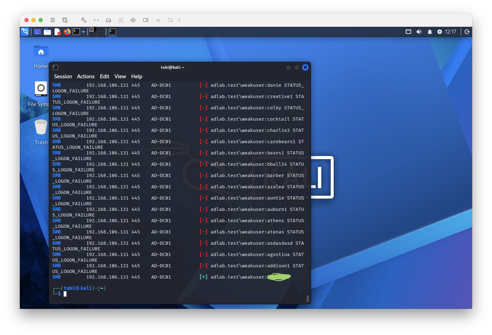
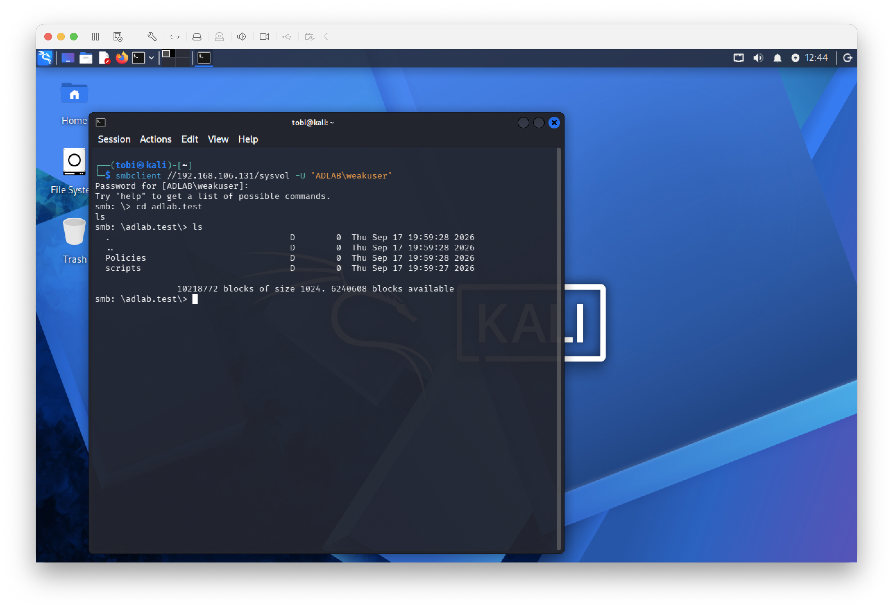
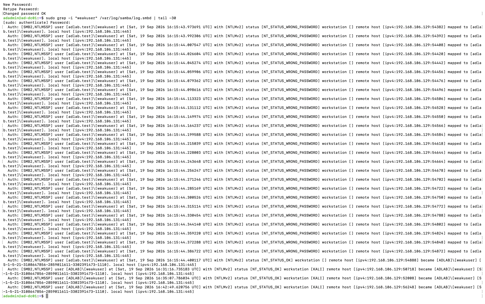

# Controlled Account Compromise and Defensive Retest

## Objective

The objective of this phase was to demonstrate a complete attack-and-defense cycle against a deliberately vulnerable account in the isolated Active Directory lab.

A dedicated account named `weakuser` was configured with a weak password specifically for controlled security testing.

The test demonstrated:

1. Password guessing against a deliberately weak account
2. Successful credential discovery
3. Authenticated SMB access
4. Server-side investigation of the attack
5. Account lockout policy hardening
6. Defensive retesting

All activity was performed exclusively within the isolated lab environment.

---

## 1. Controlled Weak Account

A dedicated domain account named `weakuser` was used for this test.

The account intentionally used a weak password so that credential attacks could be demonstrated without targeting real credentials.

This intentionally vulnerable configuration is not represented as an accidental production vulnerability.

---

## 2. Password Attack

A password attack was performed from the Kali Linux VM against the `weakuser` account.

The attack generated multiple failed SMB authentication attempts before identifying the correct password.

Successful authentication was confirmed by the attack tool.



This represented a successful controlled compromise of the `weakuser` domain account.

---

## 3. Authenticated SMB Access

The recovered credentials were used to authenticate to the Domain Controller over SMB.

Available shares included:

- `sysvol`
- `netlogon`
- `IPC$`

The compromised account successfully accessed the `SYSVOL` share and enumerated its directory structure.



This verified that the recovered credentials provided valid authenticated domain access.

The test demonstrated compromise of a standard lab account. It did not demonstrate Domain Administrator access or privilege escalation.

---

## 4. Server-Side Investigation

Samba authentication logs on the Domain Controller were reviewed after the attack.

The logs contained repeated:

```text
NT_STATUS_WRONG_PASSWORD
```

events associated with:

```text
ADLAB\weakuser
```

The events originated from the Kali Linux system at:

```text
192.168.106.129
```

Successful authentication events were also recorded after the correct credential was discovered.



This provided server-side evidence of both the unsuccessful password attempts and subsequent successful authentication.

---

## 5. Identified Security Weakness

The domain password policy was reviewed using:

```bash
sudo samba-tool domain passwordsettings show
```

The configuration showed:

```text
Account lockout threshold (attempts): 0
```

This meant repeated incorrect password attempts did not automatically lock the account.

The lack of an account lockout threshold increased the effectiveness of repeated password-guessing attempts in the lab.

---

## 6. Defensive Hardening

The domain account lockout threshold was changed to five failed authentication attempts:

```bash
sudo samba-tool domain passwordsettings set --account-lockout-threshold=5
```

The updated policy was verified using:

```bash
sudo samba-tool domain passwordsettings show
```

The resulting configuration showed:

```text
Account lockout threshold (attempts): 5
```

---

## 7. Defensive Retest

After applying the defensive change, five deliberately incorrect SMB authentication attempts were generated against `weakuser`.

The account state was checked using:

```bash
sudo samba-tool user show weakuser | grep -E "badPwdCount|lockoutTime"
```

The account showed:

```text
badPwdCount: 5
```

with a non-zero `lockoutTime`.

A subsequent authentication attempt using the previously recovered correct password returned:

```text
NT_STATUS_ACCOUNT_LOCKED_OUT
```


This verified that the newly configured account lockout policy successfully interrupted repeated password attempts by locking the targeted account after five failures.

---

## Phase Result

This phase demonstrated a complete controlled attack-and-defense workflow:

**Weak credential → password attack → credential discovery → authenticated SMB access → log investigation → security hardening → defensive retest**

The controlled attack successfully compromised the deliberately vulnerable `weakuser` account and obtained authenticated SMB access.

The activity did not result in privilege escalation or Domain Administrator compromise.

After the account lockout threshold was configured, repeated failed authentication attempts caused the account to lock, and even the correct password could no longer authenticate while the account remained locked.

This demonstrated both the original weakness and the effect of the defensive control.

All testing was performed exclusively within the isolated Active Directory lab environment.
