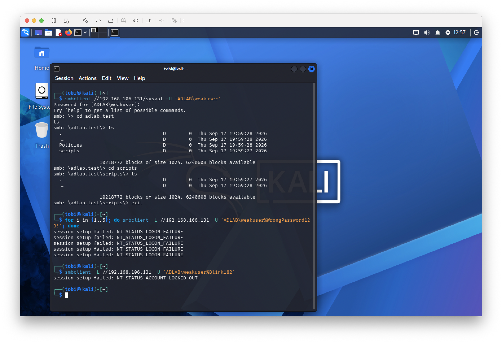
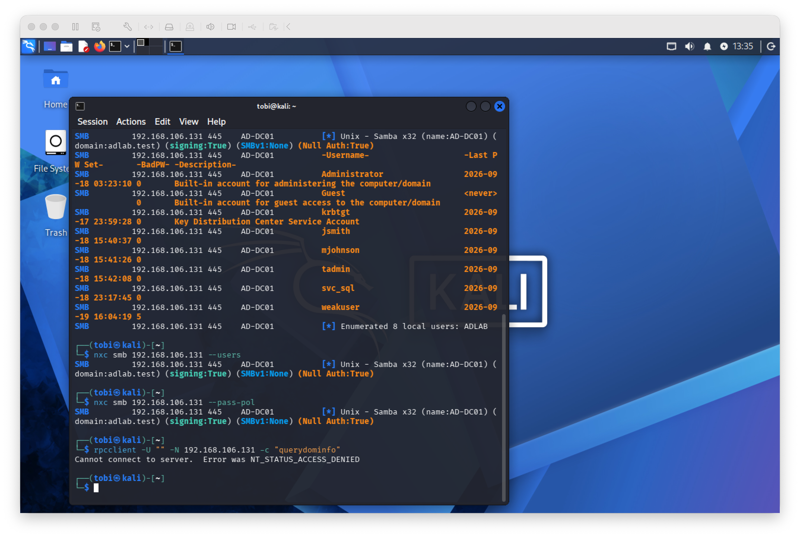

# Defensive Hardening

## Objective

The objective of this phase was to apply defensive controls based on weaknesses identified during controlled security testing and then retest the environment to verify that the controls were effective.

All testing and remediation were performed within the isolated Active Directory lab.

## 1. Account Lockout Policy

During earlier enumeration, the domain password policy showed an account lockout threshold of `0`, meaning repeated failed authentication attempts did not trigger an account lockout.

The domain policy was changed to:

```text
Account lockout threshold: 5 attempts
Account lockout duration: 30 minutes
Reset account lockout after: 30 minutes
```

The new threshold was verified with:

```bash
sudo samba-tool domain passwordsettings show
```

A controlled retest from Kali generated five incorrect SMB authentication attempts against the lab `weakuser` account.

After the fifth failed attempt, authentication using the correct password returned:

```text
NT_STATUS_ACCOUNT_LOCKED_OUT
```

The Domain Controller also showed:

```text
badPwdCount: 5
```

This verified that the account lockout policy successfully mitigated continued password guessing against the test account.



## 2. Anonymous Enumeration Hardening

Earlier security testing demonstrated that unauthenticated SMB access exposed domain usernames and password-policy information.

The Samba configuration was backed up before making changes.

```bash
sudo cp /etc/samba/smb.conf /etc/samba/smb.conf.before-anonymous-hardening
```

The following setting was added to the `[global]` section of `/etc/samba/smb.conf`:

```ini
restrict anonymous = 2
```

The configuration was validated using:

```bash
sudo testparm -s
```

The Samba Active Directory Domain Controller service was restarted and verified as active.

```bash
sudo systemctl restart samba-ad-dc
sudo systemctl is-active samba-ad-dc
```

## 3. Defensive Retesting

The same anonymous enumeration techniques used earlier were repeated from Kali after hardening.

### User Enumeration

```bash
nxc smb 192.168.106.131 --users
```

The command no longer returned the previously exposed domain-user list.

### Password Policy Enumeration

```bash
nxc smb 192.168.106.131 --pass-pol
```

The command no longer returned the previously exposed domain password-policy information.

### Anonymous RPC Enumeration

```bash
rpcclient -U "" -N 192.168.106.131 -c "querydominfo"
```

The server returned:

```text
NT_STATUS_ACCESS_DENIED
```



## Result

Defensive hardening successfully addressed two weaknesses demonstrated during controlled testing:

1. Repeated password guessing was mitigated by configuring a five-attempt account lockout threshold.
2. Anonymous domain enumeration was restricted using Samba's `restrict anonymous = 2` configuration.

Both controls were retested from the Kali Linux VM after implementation.

The lab therefore demonstrated a complete security validation cycle:

**enumeration/attack → investigation → remediation → retesting**
